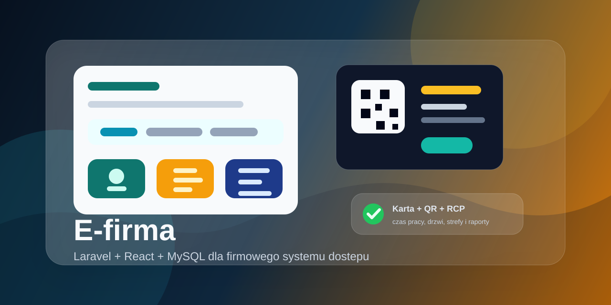
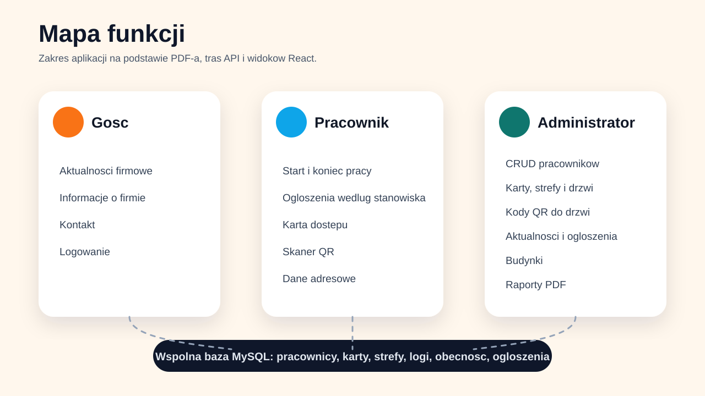
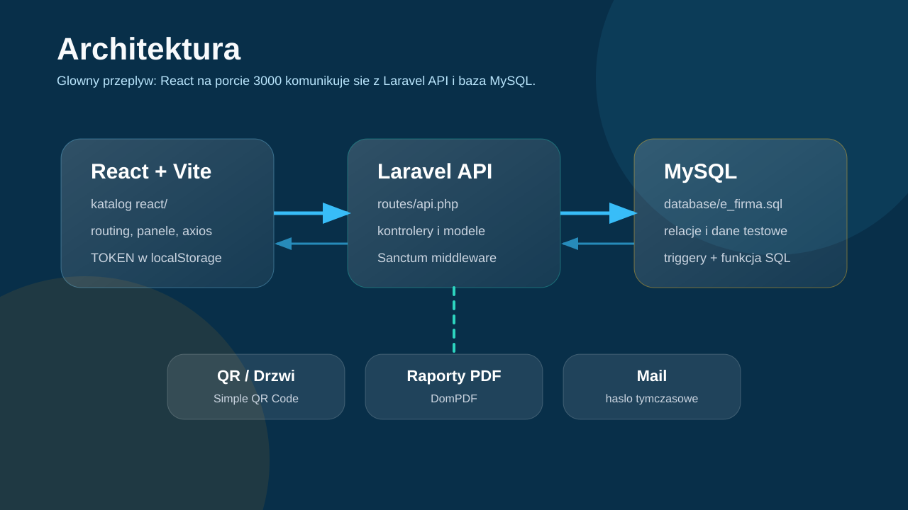
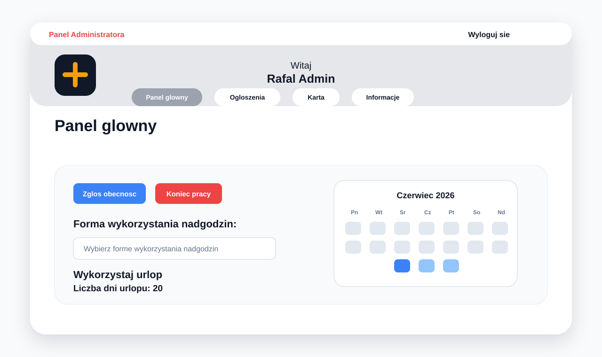
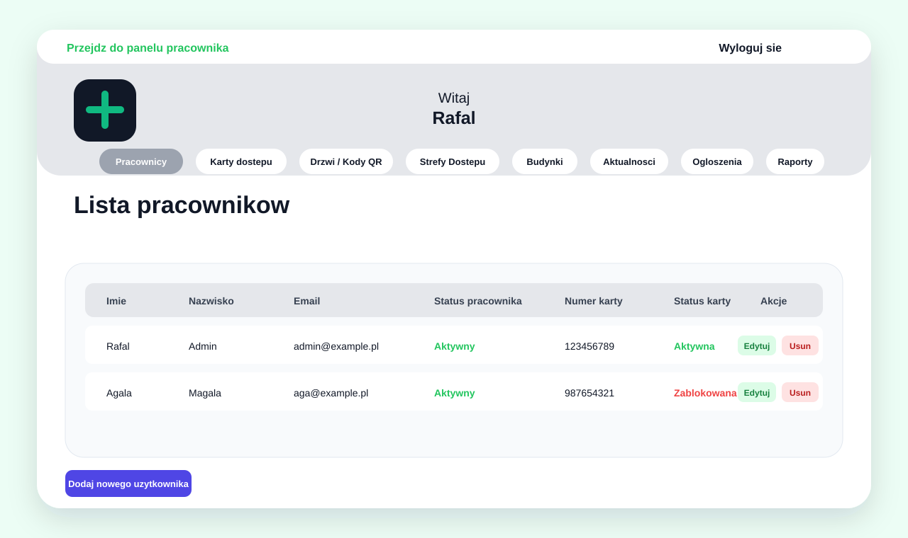
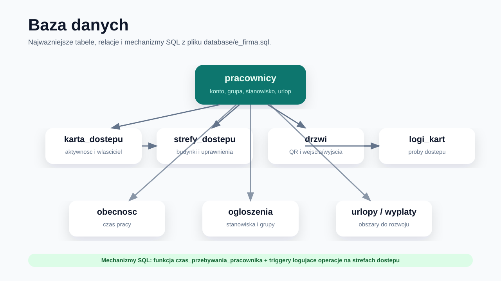

# E-firma - RCP i system kart dostepu



E-firma to studencki projekt aplikacji webowej do obslugi firmy: rejestracji czasu pracy, kart dostepu, kodow QR dla drzwi, aktualnosci, ogloszen oraz panelu administracyjnego. Backend zostal przygotowany w Laravelu, a glowny frontend aplikacji znajduje sie w katalogu `react` i komunikuje sie z API przez tokeny Laravel Sanctum.

Projekt powstal jako praca z przedmiotu Bazy Danych. W repozytorium znajduje sie rowniez dokumentacja projektowa `E_firma_Bazy_Danych.pdf`, opisujaca zalozenia, przypadki uzycia, triggery, transakcje oraz funkcje SQL.

> Uwaga: to projekt studencki, nie gotowa aplikacja produkcyjna. W repozytorium znajduje sie plik `.env`, co w normalnym publicznym projekcie nalezaloby poprawic i zastapic bezpiecznym `.env.example`. W kodzie sa tez miejsca wymagajace dopracowania, ale ten opis celowo ich nie modyfikuje.

## Podglad projektu





Pogladowe ekrany przygotowane na podstawie komponentow React:





## Najwazniejsze funkcje

- Panel goscia: strona startowa, aktualnosci, informacje o firmie, kontakt i logowanie.
- Panel pracownika: panel glowny, rejestracja rozpoczecia i zakonczenia pracy, ogloszenia, informacje o karcie dostepu, skanowanie QR oraz podstawowe dane pracownika.
- Panel administratora: zarzadzanie pracownikami, kartami dostepu, drzwiami, kodami QR, aktualnosciami, ogloszeniami, strefami dostepu, budynkami i raportami.
- System kart i dostepu: przypisywanie kart do pracownikow i stref, sprawdzanie dostepu po zeskanowaniu kodu QR oraz logowanie prob wejscia.
- Raporty PDF: raport prob dostepu karta oraz raport przepracowanych godzin.
- Baza danych MySQL: tabele domenowe, relacje, triggery dla `strefy_dostepu` oraz funkcja `czas_przebywania_pracownika`.

## Technologie

- PHP `^8.2`
- Laravel `^11.0`
- Laravel Sanctum `^4.0`
- Laravel Breeze / Inertia
- React `18`
- Vite `5`
- Tailwind CSS `3`
- MySQL / MariaDB
- DomPDF
- Simple QR Code
- html5-qrcode

## Wymagania

- PHP 8.2 lub nowszy
- Composer
- Node.js 20.x lub nowszy
- npm
- MySQL albo MariaDB
- Rozszerzenia PHP typowe dla Laravela: `pdo_mysql`, `mbstring`, `openssl`, `tokenizer`, `xml`, `ctype`, `json`, `fileinfo`
- Rozszerzenie `gd`, potrzebne m.in. do obslugi QR/PDF

Pelna lista wymagan systemowych i zaleznosci znajduje sie w [REQUIREMENTS.md](REQUIREMENTS.md). Skrocona wersja w formacie tekstowym jest w [requirements.txt](requirements.txt).

## Struktura repozytorium

```text
.
|-- app/                  # backend Laravel: modele, kontrolery, mail, requesty
|-- database/             # migracje, seedery i zrzut bazy e_firma.sql
|-- react/                # glowny frontend React + Vite na porcie 3000
|-- resources/            # zasoby Laravel/Inertia/Breeze
|-- routes/               # trasy web.php, api.php i auth.php
|-- public/               # publiczny entrypoint Laravela
|-- docs/                 # grafiki i materialy do README
|-- E_firma_Bazy_Danych.pdf
`-- README.md
```

## Uruchomienie lokalne

1. Zainstaluj zaleznosci backendu:

```bash
composer install
```

2. Przygotuj konfiguracje Laravela:

```bash
cp .env.example .env
php artisan key:generate
```

3. Ustaw baze danych w `.env`:

```env
DB_CONNECTION=mysql
DB_HOST=127.0.0.1
DB_PORT=3306
DB_DATABASE=e_firma
DB_USERNAME=root
DB_PASSWORD=
```

4. Utworz baze `e_firma` i zaimportuj zrzut:

```bash
mysql -u root -p -e "CREATE DATABASE IF NOT EXISTS e_firma CHARACTER SET utf8mb4 COLLATE utf8mb4_unicode_ci;"
mysql -u root -p e_firma < database/e_firma.sql
```

5. Uruchom backend:

```bash
php artisan serve
```

Domyslnie API bedzie dostepne pod `http://127.0.0.1:8000/api`.

6. W osobnym terminalu uruchom frontend:

```bash
cd react
npm install
```

7. Skonfiguruj adres API w `react/.env`:

```env
VITE_API_BASE_URL=http://127.0.0.1:8000
```

8. Uruchom aplikacje React:

```bash
npm run dev
```

Frontend powinien byc dostepny pod `http://localhost:3000`.

## Przydatne komendy

```bash
# Backend Laravel
php artisan serve
php artisan test
php artisan route:list

# Frontend React
cd react
npm run dev
npm run build
npm run lint
```

## Baza danych



Projekt korzysta z relacyjnej bazy MySQL. Najwazniejsze obszary danych to pracownicy, stanowiska, grupy, karty dostepu, strefy, drzwi, logi kart, obecnosc pracownikow, ogloszenia, aktualnosci, urlopy i wyplaty.

W zrzucie `database/e_firma.sql` znajduja sie m.in.:

- funkcja `czas_przebywania_pracownika(pracownik_id, data)`, ktora sumuje czas przebywania pracownika w firmie danego dnia,
- triggery `before_insert_strefy_dostepu`, `after_insert_strefy_dostepu`, `after_update_strefy_dostepu`, `before_delete_strefy_dostepu`,
- relacje miedzy pracownikami, kartami, strefami, drzwiami i logami dostepu.

## API

Glowne endpointy znajduja sie w `routes/api.php`. API obejmuje logowanie, wylogowanie, dane aktualnego uzytkownika, aktualnosci, ogloszenia, pracownikow, karty dostepu, drzwi, strefy dostepu, adresy, budynki, QR oraz raporty.

Wiekszosc operacji administracyjnych jest opakowana middleware `auth:sanctum`, a frontend dolacza token z `localStorage` jako naglowek `Authorization: Bearer ...`.

## Znane ograniczenia i rzeczy do poprawy

- Plik `.env` jest obecny w repozytorium. W projekcie produkcyjnym nie powinien byc commitowany.
- Czesc plikow ma problemy z kodowaniem polskich znakow w komentarzach lub nazwach importow.
- W repozytorium sa jednoczesnie zasoby Inertia/Breeze w `resources/js` oraz osobny frontend w `react`, co warto docelowo uporzadkowac.
- Nie wszystkie funkcje opisane w dokumentacji projektowej wygladaja na w pelni domkniete w API, np. obsluga urlopow i wybor sposobu wykorzystania nadgodzin.
- Projekt zawiera zaleznosci `vendor` i `node_modules`; zwykle nie trzyma sie ich w repozytorium, tylko odtwarza przez Composer i npm.

## Dokumentacja projektowa

Szczegolowy opis zalozen znajduje sie w pliku `E_firma_Bazy_Danych.pdf`. Dokument opisuje cel projektu, wymagania funkcjonalne i niefunkcjonalne, dobor technologii, przypadki uzycia dla administratora/pracownika/goscia, triggery SQL, transakcje, funkcje bazodanowe oraz podsumowanie wykonanych i niewykonanych elementow.
